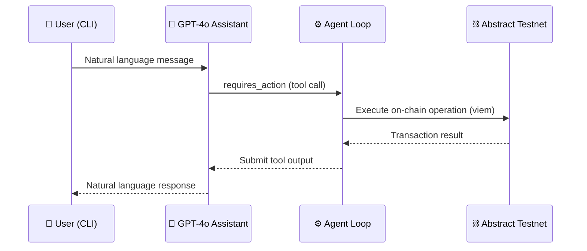

<div align="center">

# Dimensity

**AI-Powered On-Chain Assistant**

An autonomous CLI agent that interacts with the [Abstract Testnet](https://abs.xyz/) blockchain through natural language — powered by OpenAI and viem.

[](https://nodejs.org/)
[](https://www.typescriptlang.org/)
[](https://platform.openai.com/)
[](https://opensource.org/licenses/MIT)

</div>

---

## 📖 Overview

**Dimensity** is a TypeScript CLI chatbot that connects GPT-4o to a live blockchain wallet. It uses the [OpenAI Assistants API](https://platform.openai.com/docs/assistants/overview) with function calling to autonomously decide when and how to execute on-chain operations — no manual transaction crafting required.

The assistant operates on **Abstract Testnet**, a zkSync-based Layer 2 network, using [viem](https://viem.sh/) for type-safe Ethereum interactions with native EIP-712 transaction support.

---

## ⚙️ Features

| Tool | Description |
|:-----|:------------|
| `get_balance` | Query the native ETH balance of any wallet address |
| `get_wallet_address` | Retrieve the connected wallet's address |
| `send_transaction` | Transfer ETH from the connected wallet to a recipient |
| `deploy_ERC20` | Deploy a new ERC-20 token with custom name, symbol, and initial supply |

---

## 🧠 How It Works



1. On startup, an OpenAI Assistant is created with four on-chain tool definitions.
2. A conversation thread is initialized, and the user interacts via the terminal.
3. When the model determines a tool is needed, the agent loop intercepts the `requires_action` run status.
4. The corresponding handler executes the blockchain operation through viem.
5. The tool output is submitted back to the run, and the model composes a natural language response.

---

## 🏗️ Architecture

```
src/
├── index.ts                        # CLI entry point — interactive readline loop
├── openai/
│   ├── createAssistant.ts          # Initializes GPT-4o assistant with tool schemas
│   ├── createThread.ts             # Creates a new conversation thread
│   ├── createRun.ts                # Creates and polls a run until resolution
│   ├── performRun.ts               # Recursive agent loop for tool-call handling
│   └── handleRunToolCall.ts        # Dispatches tool calls to registered handlers
├── tools/
│   ├── allTools.ts                 # Tool registry and ToolConfig type interface
│   ├── getBalance.ts               # Reads native ETH balance via public client
│   ├── getWalletAddress.ts         # Returns the wallet address derived from private key
│   ├── sendTransaction.ts          # Signs and sends ETH via wallet client
│   └── deployErc20.ts              # Deploys an ERC-20 contract via wallet client
├── viem/
│   ├── createViemPublicClient.ts   # Read-only JSON-RPC client (Abstract Testnet)
│   └── createViemWalletClient.ts   # Signing client with EIP-712 wallet actions
└── const/
    └── contractDetails.ts          # ERC-20 ABI and compiled bytecode
```

**Key design decisions:**

- **Tool registry pattern** — All tools are defined in `allTools.ts` with a unified `ToolConfig` interface containing both the OpenAI function schema and the handler. Adding a new tool requires only defining a new config object and registering it.
- **Recursive agent loop** — `performRun.ts` continuously processes `requires_action` statuses until the run completes, enabling multi-step tool-call chains within a single user message.
- **EIP-712 support** — The wallet client extends viem's `eip712WalletActions()` for native zkSync transaction signing.

---

## 🚀 Getting Started

### Prerequisites

| Requirement | Details |
|:------------|:--------|
| **Node.js** | Version 18 or higher |
| **npm** | Included with Node.js |
| **OpenAI API Key** | Obtain from [platform.openai.com](https://platform.openai.com/api-keys) |
| **Private Key** | For an Abstract Testnet wallet funded with testnet ETH |

### Installation

```bash
# Clone the repository
git clone https://github.com/Hitman350/Openai-onchain-assistant.git
cd Openai-onchain-assistant

# Install dependencies
npm install
```

### Configuration

Create a `.env` file in the project root:

```env
OPENAI_API_KEY=sk-your-openai-api-key
PRIVATE_KEY=0xyour-abstract-testnet-private-key
```

> [!CAUTION]
> Never commit your `.env` file to version control. The `.gitignore` is preconfigured to exclude it. Rotate any keys that may have been exposed.

### Obtaining Testnet ETH

Visit the [Abstract Testnet Faucet](https://faucet.abs.xyz/) to fund your wallet with testnet ETH before sending transactions or deploying contracts.

### Running

```bash
npm start
```

This compiles the TypeScript source and launches the interactive CLI. Type your messages and press **Enter**. Type `exit` to end the session.

---

## 💬 Usage Examples

```
You: What is my wallet address?
Dimensity: Your connected wallet address is 0x1234...abcd

You: Check the balance of 0xabc...def
Dimensity: The balance of that wallet is 0.5 ETH

You: Send 0.01 ETH to 0xabc...def
Dimensity: Transaction sent successfully. Tx Hash: 0x9f3a...

You: Deploy a token called "Starlight" with symbol "STAR" and initial supply of 1 million
Dimensity: Starlight (STAR) token deployed successfully at: 0x7b2c...
```

---

## 🔗 Network Details

| Property | Value |
|:---------|:------|
| **Chain** | Abstract Testnet |
| **Network Type** | zkSync-based Layer 2 |
| **EIP-712** | Supported via `eip712WalletActions` |
| **Faucet** | [faucet.abs.xyz](https://faucet.abs.xyz/) |
| **Explorer** | [explorer.testnet.abs.xyz](https://explorer.testnet.abs.xyz/) |

---

## 🧰 Tech Stack

| Technology | Role |
|:-----------|:-----|
| [**OpenAI SDK**](https://github.com/openai/openai-node) | Assistants API with function calling (GPT-4o) |
| [**viem**](https://viem.sh/) | Type-safe Ethereum client — public and wallet clients |
| [**TypeScript**](https://www.typescriptlang.org/) | Strict mode, ES2022 target, NodeNext module resolution |
| [**dotenv**](https://github.com/motdotla/dotenv) | Environment variable management |

---

## 🤝 Contributing

Contributions are welcome. To add a new on-chain tool:

1. Create a new file in `src/tools/` implementing the `ToolConfig` interface.
2. Define the OpenAI function schema (`definition`) and the handler function.
3. Register the tool in `src/tools/allTools.ts`.

```ts
// Example: src/tools/myNewTool.ts
import { ToolConfig } from "./allTools";

export const myNewTool: ToolConfig<{ param: string }> = {
  definition: {
    type: "function",
    function: {
      name: "my_new_tool",
      description: "Description of what this tool does",
      parameters: {
        type: "object",
        properties: {
          param: { type: "string", description: "Parameter description" },
        },
        required: ["param"],
      },
    },
  },
  handler: async ({ param }) => {
    // Implementation
    return `Result for ${param}`;
  },
};
```

---

## 📄 License

This project is licensed under the [MIT License](LICENSE).
